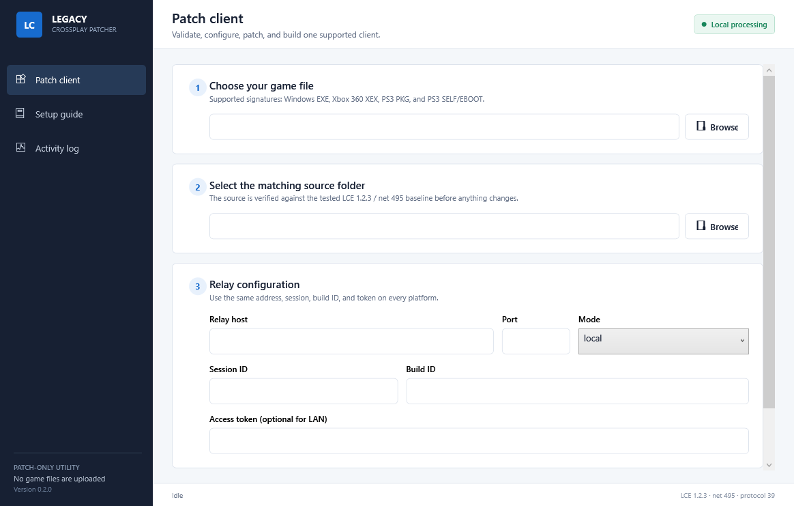
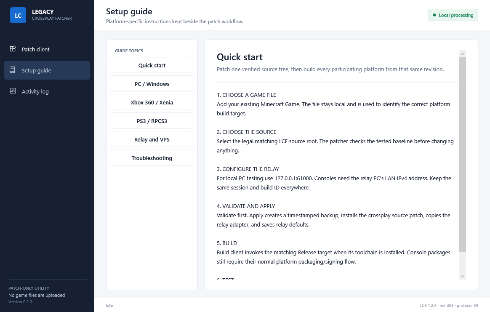

# Minecraft Legacy Console Crossplay

A patch-only crossplay project for a matching Minecraft Legacy Console Edition
source baseline. It connects a native PC host, Xbox 360/Xenia, and PS3/RPCS3
through the same relay session.

[Download the latest patcher](https://github.com/modsn1per69-ship-it/MinecraftLCE-crossplay/releases/latest)
· [Join the Discord](https://discord.gg/2rvruaWDXk)
· [Support the project](https://buymeacoffee.com/sn1per)



## Discord technical support bot

The optional [Discord support bot](support-bot/README.md) can diagnose build,
relay and crossplay errors from logs and project documentation. It supports
`/ask`, direct mentions, text-log attachments and restricted support-channel
automatic replies. Known failures are checked locally before the optional AI
diagnosis, including missing Xbox 360 media headers, physical clients compiled
with loopback, session mismatches and stalled joins.

## New patcher guide

Legacy Crossplay Patcher is the recommended setup method. It keeps the process
local, verifies the exact source baseline, creates backups, applies the
crossplay patch, saves relay settings, and can launch the selected platform
build when its toolchain is installed.

### 1. Download and open

Download `LegacyCrossplayPatcher.exe` from the latest GitHub release and open
it on Windows 10 or Windows 11.

The release EXE is self-contained. A separate .NET installation is not needed.

### 2. Add Minecraft Game

Select **Browse** under **Choose your game file**, then add your legally
obtained **Minecraft Game**.

The patcher:

- detects the PC, Xbox 360, or PS3 format locally
- calculates a SHA-256 hash
- never uploads or bundles the selected game
- uses the result to choose the correct build target

### 3. Select the source

Choose the clean matching LCE source root. The patcher checks 30 files against
the tested SHA-256 manifest before it changes anything.

Do not force the patch onto another title update, an older experiment, or a
source tree that has unrelated modifications.

### 4. Configure the relay

| Setting | Local PC test | LAN consoles | External VPS |
| --- | --- | --- | --- |
| Relay host | `127.0.0.1` | Relay PC's LAN IPv4 | VPS public IPv4 |
| Port | `61000` | `61000` | `61000` |
| Mode | `local` | `local` | `vps` |
| Session ID | Same on every client | Same on every client | Same on every client |
| Build ID | Keep the tested default | Keep the tested default | Keep the tested default |
| Access token | Empty | Optional on trusted LAN | Required |

Xbox 360 and PS3 builds should use a numeric IPv4 address. Do not use
`127.0.0.1` for a physical console.

### 5. Validate and patch

Select **Validate** first. A successful check confirms the matching baseline.

Select **Apply patch**. The patcher then:

1. creates `LegacyCrossplayBackups/<timestamp>/` inside the source root
2. checks the patch with `git apply --check`
3. applies the crossplay source patch
4. installs all eight relay adapter files
5. writes the shared relay configuration

Running Apply again on an already patched source updates only the relay
configuration.

### 6. Build Minecraft Game

Select **Build client** after patching.

| Platform | Build target | Requirement |
| --- | --- | --- |
| PC | `Release|x64` | Source project's Windows compiler/toolset |
| Xbox 360 | `Release|Xbox 360` | Licensed Xbox 360 SDK and MSBuild integration |
| PS3 | `Release|PS3` | PS3 SDK/project integration used by the legal source environment |

The patcher does not download proprietary console SDKs, firmware, keys,
certificates, source trees, or game content.

Signed console packages are not rewritten in place. The platform toolchain
must compile and package the patched source normally.

### 7. Run the session

1. Start the relay.
2. Start the PC build and enter an online world as host.
3. Start Xbox 360/Xenia and join the same relay session.
4. Start PS3/RPCS3 and join the same relay session.
5. Verify chat, movement, usernames, player visibility, and full chunk loading.



## Start a local relay

Install the .NET 8 SDK, open PowerShell in the repository, and run:

```powershell
.\scripts\start-relay.ps1 -BindAddress 127.0.0.1 -Port 61000
```

For trusted LAN consoles:

```powershell
.\scripts\start-relay.ps1 -BindAddress 0.0.0.0 -Port 61000
```

Allow inbound TCP `61000` on the Private firewall profile and use the relay
PC's LAN IPv4 address in every console build.

## Run the relay on a VPS

The simplest supported VPS deployment uses Docker Compose:

```bash
git clone https://github.com/modsn1per69-ship-it/MinecraftLCE-crossplay.git
cd MinecraftLCE-crossplay
cp .env.example .env
```

Edit `.env` and replace the example token with a strong private value:

```text
CONSOLE_LEGACY_RELAY_TOKEN=replace-with-a-random-token
RELAY_PORT=61000
```

Then start the service:

```bash
docker compose up -d --build
docker compose ps
docker compose logs legacy-crossplay-relay
```

Open TCP `61000` in both the VPS provider firewall and the operating-system
firewall. Restrict source IPs where possible. Every client must use the same
VPS IPv4 address, port, session, build ID, and token.

The token authenticates the relay handshake but does not encrypt gameplay
traffic. Prefer a VPN or strict firewall rules for public deployments.

## Exact tested baseline

| Platform | Tested identity |
| --- | --- |
| PC host | Native Windows64 source build `1.3.0495.0`, `Release|x64` |
| Xbox 360 | Xbox 360 Edition `1.0.10.0`, title ID `584111F7` |
| PS3 | PS3 Edition `BLES01976`, update `1.84`, `APP_VER=01.84` |
| Source | LCE `1.2.3`, net version `495`, protocol `39` |

Required relay build ID:

```text
584111F7-1.0.10.0-lce1.2.3-net495-proto39
```

Do not mix a different source revision, network version, packet protocol, or
stale client build.

Recorded successful emulator environment:

| Emulator | Tested build |
| --- | --- |
| Xenia | `master@95a5c3ee2` |
| RPCS3 | `v0.0.41-19595-9b3a916a Alpha` |

## What the patcher fixes

- PC, Xbox 360, and PS3 clients in one relay session
- canonical cross-platform player identities
- third-player visibility and username synchronization
- compatible movement packets and absolute corrections
- raw chunk transfer across platform compression differences
- PC biome-tail color corruption
- incomplete world loading on console clients
- PS3 join lag through a 32 KiB per-frame receive budget

## Build the patcher from source

```powershell
.\scripts\build-patcher.ps1
```

Output:

```text
patcher/publish/win-x64/LegacyCrossplayPatcher.exe
```

Run the automated checks:

```powershell
dotnet run --project .\patcher.tests\PatcherSmokeTests.csproj -c Release -- <clean-source-fixture> <target-exe>
.\scripts\test-relay.ps1
```

## Repository contents

This repository includes:

- the open-source Windows patcher
- the open-source relay server
- source-level compatibility patches
- reversible patch and verification scripts
- local, Docker Compose, and `systemd` relay deployment files
- automated patcher and three-peer relay tests

It does not include:

- Minecraft game binaries or assets
- complete proprietary source trees
- console SDKs, firmware, keys, or certificates
- license checks or entitlement bypasses
- prebuilt modified XEX, PKG, SELF, or game packages

## Advanced reference

- [Patcher internals and recovery](docs/PATCHER.md)
- [Relay architecture](docs/ARCHITECTURE.md)
- [Legal and distribution boundaries](docs/LEGAL.md)
- [Contributing](CONTRIBUTING.md)
- [Changelog](CHANGELOG.md)

## Community and support

- Discord: [discord.gg/2rvruaWDXk](https://discord.gg/2rvruaWDXk)
- Buy Me a Coffee: [buymeacoffee.com/sn1per](https://buymeacoffee.com/sn1per)

Minecraft is a trademark of Mojang Synergies AB. Xbox and Microsoft are
trademarks of Microsoft. PlayStation is a trademark of Sony Interactive
Entertainment. This independent compatibility project is not affiliated with
or endorsed by Mojang, Microsoft, Sony, 4J Studios, RPCS3, or Xenia.
